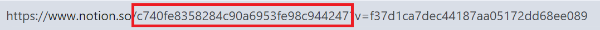

# Quote Bot DataBase
This is server that manages database for quote bot. Allows to store quote data in database instead of making 
request to Notion each time.

## How to set up

1. Duplicate notion database template for your book notes [from here](https://adjoining-busby-a09.notion.site/c740fe8358284c90a6953fe98c944247?v=f37d1ca7dec44187aa05172dd68ee089&pvs=4).
2. Add some book notes to your notion database.
3. Create `.env` file at the root of the project and specify environment variables. List of environment variables [can be found here](?tab=readme-ov-file#required).
   1. To get `BOT_TOKEN`, create your bot using [BotFather](https://t.me/BotFather).
   2. To get `CHAT_ID`, start chat with your bot. Forward `/start` message from chat with your bot to (Get My ID bot)(https://t.me/getmyid_bot).
   3. To get `NOTION_DATABASE_ID`, go to your notion database page and copy id from url.
      
   4. To get `NOTION_TOKEN`, create integration using [getting started section from notion API documentation](https://developers.notion.com/docs/create-a-notion-integration#getting-started).
   5. Don't forget to [give your integration permissions to notion database page](https://developers.notion.com/docs/create-a-notion-integration#give-your-integration-page-permissions).
4. Install dependencies with `yarn install` and run the app using `yarn start`. At this point telegram bot should send starting message to you.
5. Send `/update` command to the chat with telegram bot.
6. To test the bot send `/test` command to the chat with telegram bot. It should respond with a quote.

## API endpoints:

``/bot-start`` - 
start telegram bot that will listen for your commands.
 
You can see available bot commands below.

``/bot-update`` - fetch data from Notion and update database.

``/boot-kill`` - stop telegram bot.

## Telegram bot commands

``test`` - test that bot is running. It will send you test message.

``update`` - update database. Do this after adding notes to notion.
## Environment variables

### Required

``BOT_TOKEN`` - Telegram bot token.

``CHAT_ID`` - Telegram chat id.

``NOTION_DATABASE_ID`` - ID of notions database with quotes.

``NOTION_TOKEN`` - Notion token to use its API.

### Optional

``PORT`` - Port for the server. By default, port 8000 will be used.

``API_URL`` - URL of server with database.
